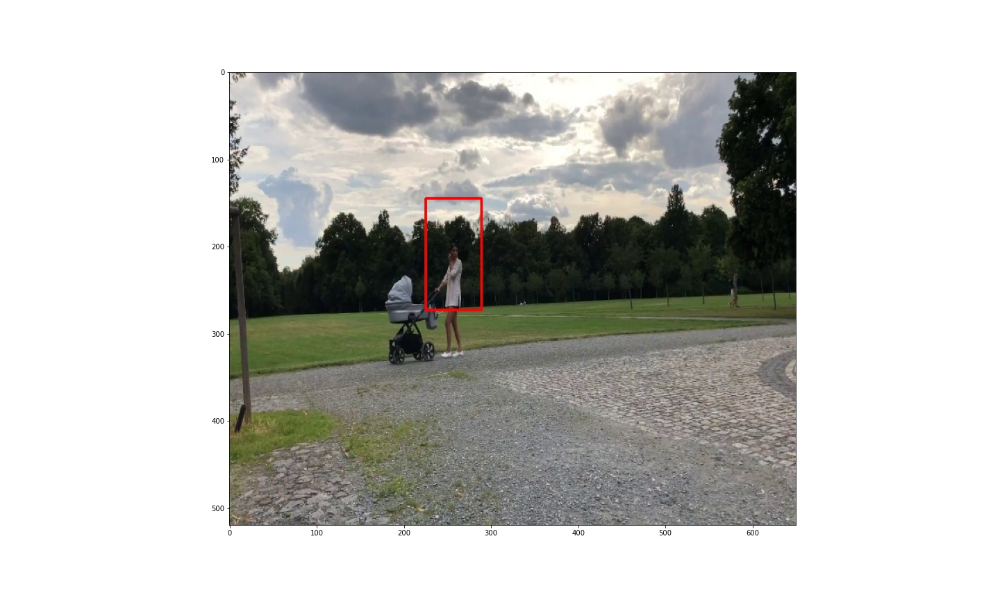

# Detekce lidí

Tento repozitář slouží jako úschovna kóddů použitých v bakalářské práci.

## HOG_SVM

originální repozitář: https://github.com/SamPlvs/Object-detection-via-HOG-SVM

Metoda funguje základě výpočtu HOG příznaků z posuvného okénka. SVM klasifikační metoda pak rozhoduje o objektu.

HOG_train.ipynb -> trénování SVM

HOG_test.ipynb -> vizualizace predikovaných ohraničení

HOG_evaluate.ipynb -> testování modelu pomocí testovací množiny dat

## SSD

Originální repozitář: https://github.com/pierluigiferrari/ssd_keras

Tato metoda predikuje objekty z konvolučních vrstev neuronové sítě založené na architektuře SSD512.

weight_sampling.ipynb -> pro vytvoření modelu z předtrénovaných vah

train_SSD.py -> trénování modelu

test_SSD.ipynb -> vizualizace predikovaných ohraničení

evaluation_SSD.ipynb -> testování modelu pomocí testovací množiny dat

Je potřeba mít nainstalované:

TensorFlow 1.x -> doporučuji tensorflow-gpu==1.13.1

Keras 2.x -> doporučuji Keras==2.2.4

CUDA v10.0.0

cudNN v 10.0

![(SSD/test_img/ssd_test.jpg)
 
