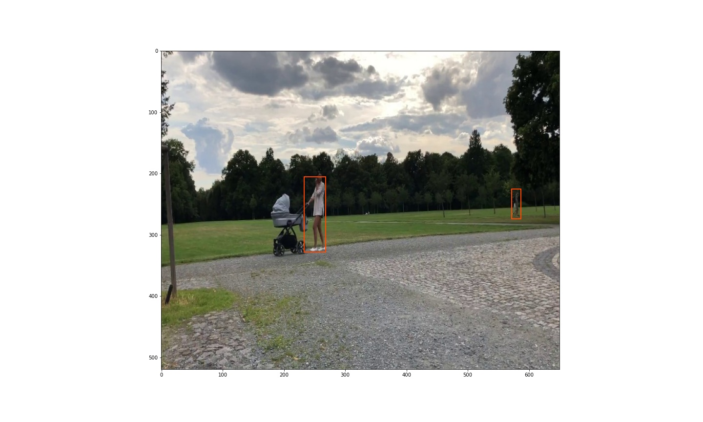

# Detekce lidí

Tento repozitář slouží jako úschovna kódů použitých v bakalářské práci.

## HOG_SVM

originální repozitář: https://github.com/SamPlvs/Object-detection-via-HOG-SVM

Metoda funguje základě výpočtu HOG příznaků z posuvného okénka. SVM klasifikační metoda pak rozhoduje o objektu. 

Jednotlivé scripty ve složce [HOG_SVM](HOG_SVM) a jejich funkce:
* [HOG_train.ipynb](HOG_SVM/HOG_train.ipynb) -> trénování SVM
* [HOG_test.ipynb](HOG_SVM/HOG_test.ipynb) -> vizualizace predikovaných ohraničení
* [HOG_evaluate.ipynb](HOG_SVM/HOG_evaluate.ipynb) -> testování modelu pomocí testovací množiny dat

## SSD

Originální repozitář: https://github.com/pierluigiferrari/ssd_keras

Tato metoda predikuje objekty z konvolučních vrstev neuronové sítě založené na architektuře SSD512.

Natrénovaný model je nutné stáhnout z odkazu [zde](https://drive.google.com/drive/folders/17qpBcxiJ6j53FiAyjv_41v_vTorCnPQH?usp=sharing) a vložit do [SSD/load_models](SSD/load_models).

Jednotlivé scripty ve složce [SSD](SSD) a jejich funkce:
* [weight_sampling.ipynb](SSD/weight_sampling.ipynb) -> pro vytvoření modelu z předtrénovaných vah
* [train_SSD.py](SSD/train_SSD.py) -> trénování modelu
* [test_SSD.ipynb](SSD/test_SSD.ipynb) -> vizualizace predikovaných ohraničení
* [evaluation_SSD.ipynb](SSD/evaluation_SSD.ipynb) -> testování modelu pomocí testovací množiny dat

Je potřeba mít nainstalované:
* TensorFlow 1.x -> doporučuji tensorflow-gpu==1.13.1
* Keras 2.x -> doporučuji Keras==2.2.4
* CUDA v10.0.0
* cudNN v 10.0

## annotation_maker

Slouží k vytvoření anotací lidí z videonahrávky.

Jednotlivé scripty ve složce [annotation_maker](annotation_maker) a jejich funkce:

* mov_to_jpg.ipynb -> převedení videonahrávky na .jpg obrázky
* annotation_maker.ipynb -> anotace lidí z obrázků ukládána do .json formátu podle vzoru MS COCO 
 
